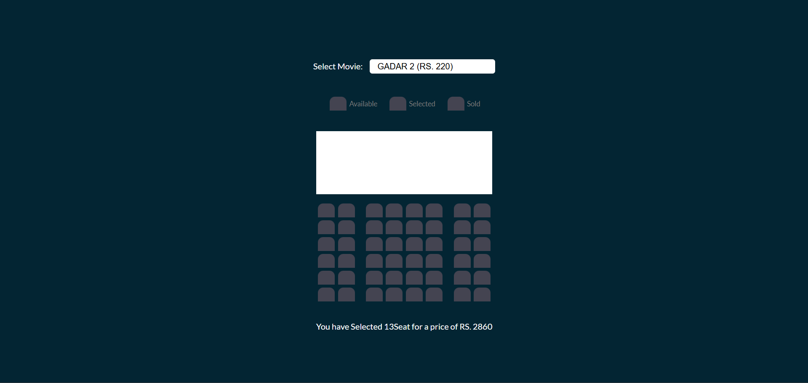

#   Basic Movie Ticket Booking


## Table of Contents

## Introduction

This project is a simple web-based movie ticket booking application. It allows users to select a movie, choose seats from an interactive seating layout, and view the total cost of selected tickets. User preferences, such as selected seats and movie choice, are saved using local storage.

---

## Features

- **Movie Selection**: Users can choose from a list of movies with different ticket prices.
- **Interactive Seating**: An intuitive seating layout where users can select or deselect seats.
- **Price Calculation**: Automatically calculates and displays the total price of selected tickets.
- **Local Storage**: Remembers selected seats and movie preferences even after page reloads.
- **Responsive Design**: Compatible with both mobile and desktop devices for seamless usage.

---

## Files Included

### 1. HTML (`index.html`)
- **Dropdown Menu**: For selecting a movie.
- **Seating Layout**: Interactive rows of seats for user selection.
- **Dynamic Display**: Shows the count of selected seats and total price.

### 2. CSS (`style.css`)
- **Modern Styling**: Clean and user-friendly design.
- **Seating States**: Differentiates available, selected, and sold seats visually.
- **Responsive Design**: Ensures adaptability across screen sizes.

### 3. JavaScript (`script.js`)
- **Interactive Features**: Handles movie selection, seat toggling, and price updates.
- **Local Storage Integration**: Saves user preferences persistently.
- **Dynamic Updates**: Real-time adjustments as users interact with the UI.

---

## How to Run

1. Clone the repository:
   ```bash
   git clone https://github.com/himanshigupta14/Basic-movie-ticket-booking.git
